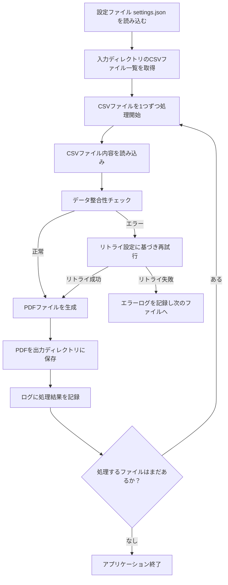

# 設計書

## 概要

### 背景・目的

背景：スプレッドシートのタスクを手作業でMicrosoft To Doへ転記するのは手間であった。

目的：スプレッドシートのタスクを自動でMicrosoft To Doに連携し、転記作業を省力化・効率化する。

### 機能一覧

* Googleスプレッドシートの「Tasks」シートに記載されたタスクをMicrosoft To Doへ自動で登録します。
* MicrosoftアカウントのOAuth2認証フロー（認証URL生成・認可コード入力・トークン取得）を実行できます。
* アクセストークンの有効期限を管理し、期限切れ時は自動でリフレッシュします。
* タスクごとに登録結果（成功またはエラー内容）を「result」列に出力します。
* タイトルやリスト名などの必須項目をバリデーションします。
* 期限日、リマインダー、本文、繰り返し設定など各種タスク属性を反映して登録します。
* Googleスプレッドシートのカスタムメニューから認証やタスク登録などの操作を実行できます。

## 入力（Googleスプレッドシート構成）

本スクリプトは、以下2つのシート構成を前提としています。

### 「Auth」シート

| セル | 内容 |
| ---- | ---- |
| A1   | MicrosoftアプリのClient ID |
| A2   | MicrosoftアプリのClient Secret |
| A3   | Authorization Code |
| A4   | アクセストークン（自動取得・更新） |
| A5   | リフレッシュトークン（自動取得・更新） |
| A6   | 認証URL（自動生成） |
| A7   | トークン有効期限（自動生成、UNIXミリ秒、内部管理用） |

### 「Tasks」シート

| 列名         | 内容                         |
| ------------ | ---------------------------- |
| title        | タスクのタイトル（必須）     |
| list_name    | 登録先リスト名（必須）       |
| body         | タスクの本文（任意）         |
| due          | 期限日  |
| reminder     | リマインダー日時             |
| status       | タスクの状態（任意、未指定時はnotStarted） |
| recurrence_type  | 繰り返し種別（任意、未指定時は繰り返しなし） |
| recurrence_start | 繰り返し開始日（任意）        |
| recurrence_end   | 繰り返し終了日（任意）        |
| recurrence_interval | 繰り返し間隔（任意、数値） |
| result       | 登録結果（自動出力）         |

#### status列に指定可能な値

| 値                | 意味         |
|-------------------|--------------|
| notStarted        | 未開始       |
| inProgress        | 進行中       |
| completed         | 完了         |
| waitingOnOthers   | 他者待ち     |
| deferred          | 延期         |

#### recurrence_type列に指定可能な値

| 値         | 意味         |
|------------|--------------|
| daily      | 毎日         |
| weekly     | 毎週         |
| absoluteMonthly | 毎月（特定日） |
| absoluteYearly  | 毎年（特定日） |
| relativeMonthly | 毎月（第n曜日など） |
| relativeYearly  | 毎年（第n曜日など） |

## 出力

* Googleスプレッドシート「Tasks」シートの「result」列に、各タスクの登録結果（Successまたはエラー内容）を自動で出力します。
* Microsoft To Doに、Tasksシートで指定した内容のタスクが登録されます。
* Googleスプレッドシート上で、処理完了やエラー発生時にダイアログメッセージが表示されます。

※ ファイルとしての出力（CSVやPDFなど）はありません。

## 実行方法

1. Googleスプレッドシートを開き、「拡張機能」→「Apps Script」から本スクリプト（MicrosoftToDoImporter.gs）を貼り付けて保存します。
2. スプレッドシートに「Auth」シートと「Tasks」シートを作成し、必要なセル・列を準備します。
3. 「Auth」シートのA1・A2セルにMicrosoftアプリのClient ID・Client Secretを入力します。
4. スプレッドシートを再読み込みし、メニューに「Microsoft To Do」が追加されていることを確認します。
5. メニューから「認証URL生成」を選択し、A6セルのURLをブラウザで開いて認可コードを取得します。
6. 認可コードをA3セルに貼り付け、「トークン取得」を実行してアクセストークンを取得します。
7. 「Tasks」シートにタスク情報を記入し、「TasksシートからTo Doに登録」を実行します。
8. 各タスクの登録結果が「result」列に出力されます。

## 想定実行環境

| 項目 | 内容 |
| ---- | ---- |
| CPU | Intel 第10世代 Core i5 以上相当 |
| メモリー | 8 GB 以上 |
| OS | Windows 10 / Windows 11 |
| Python | 3.x 以降 |
| Pythonライブラリー | pandas==1.5.3 <br/> requests==2.31.0 |

## 処理詳細

1. 設定ファイル `settings.json` を読み込む。
1. 入力ディレクトリに存在するCSVファイルのリストを取得する。
1. 取得したCSVファイルを1つずつ処理開始。
1. 各CSVファイルの内容を読み込み、データを検証する。
1. 処理中にエラーが発生した場合、リトライ設定に基づき再試行する。
1. 正常に処理が完了したデータをもとにPDFファイルを生成する。
1. 生成したPDFを指定された出力ディレクトリに保存する。



## ログ出力

### ログ出力概要

| 項目 | 内容 |
| ---- | ---- |
| 出力先 | logs/app_yyyyMMdd.log |
| ログレベル | INFO / ERROR |
| フォーマット | `yyyy-MM-dd HH:mm:ss [LEVEL] message` |

### ログ出力例

```text
2025-06-07 14:23:01 [INFO] アプリケーションを開始しました
2025-06-07 14:23:01 [INFO] 設定ファイルを読み込みました: settings.json
2025-06-07 14:23:01 [INFO] 入力ディレクトリ: data/input
2025-06-07 14:23:01 [INFO] 出力ディレクトリ: data/output
2025-06-07 14:23:01 [INFO] リトライ設定: 有効（最大3回、5秒間隔）
2025-06-07 14:23:02 [INFO] ファイルの処理を開始: input_001.csv
2025-06-07 14:23:03 [ERROR] 処理中にエラーが発生しました: 接続タイムアウト
2025-06-07 14:23:03 [INFO] リトライ 1回目（5秒後に再試行）
2025-06-07 14:23:08 [INFO] リトライ成功: input_001.csv を再処理中
2025-06-07 14:23:09 [INFO] 処理完了: input_001.csv（出力: output_001.csv）
2025-06-07 14:23:10 [INFO] 全ファイルの処理が完了しました
2025-06-07 14:23:10 [INFO] アプリケーションを終了します
```

### ログメッセージ

| No. | レベル | テンプレート |
| ---- | ---- | ---- |
| 1 | INFO | アプリケーションを開始しました |
| 2 | INFO | 設定ファイルを読み込みました: `{file_name}` |
| 3 | INFO | 入力ディレクトリ: `{input_dir}` |
| 4 | INFO | 出力ディレクトリ: `{output_dir}` |
| 5 | INFO | リトライ設定: `{enabled_display}（最大{max_retries}回、{interval}秒間隔）` |
| 6 | INFO | ファイルの処理を開始: `{file_name}` |
| 7 | ERROR | 処理中にエラーが発生しました: `{error_message}` |
| 8 | INFO | リトライ `{retry_count}`回目（{interval}秒後に再試行） |
| 9 | INFO | リトライ成功: `{file_name}` を再処理中 |
| 10 | INFO | 処理完了: `{input_file}`（出力: `{output_file}`） |
| 11 | INFO | 全ファイルの処理が完了しました |
| 12 | INFO | アプリケーションを終了します |

## ライセンス

### 本プログラムのライセンス

* このプログラムはMITライセンスに基づいて提供されます。

### 使用ライブラリーのライセンス

| ライブラリ名 | バージョン | ライセンス |
| ---- | ---- | ---- |
| pandas | 1.5.3 | BSD 3-Clause |
| requests | 2.31.0 | Apache License 2.0 |
| fpdf | 1.7.2 | LGPLv3 |

## 開発詳細

### 開発環境

* VSCode バージョン 1.100.3
* Python 3.11.4

### 検証環境

| 項目 | 内容 |
| ---- | ---- |
| CPU | Intel64 Family 6 Model 154 Stepping 3 |
| メモリー | 16 GB |
| OS | Windows 11 |
| Python | 3.11.4 |
| Pythonライブラリー | pandas==1.5.3 <br/> requests==2.31.0 |

## 改訂履歴

* テンプレートの改訂履歴を示しています。このテンプレートを使用する際は、ツールの改訂履歴に置き換えてください。

| バージョン | 日付 | 内容 |
| ----- | ---------- | -------------- |
| 1.1.1 | 2025-06-08 | 内容を改訂。<ul><li>概要に「背景・目的」と「機能一覧」を追加。</li><li>ライセンス情報に使用ライブラリとそのライセンスを明記。</li><li>「開発詳細」セクションを新設（開発環境と検証環境を分離）。</li><li>全体の見出し構成を調整し、情報の分類を明確化。</li><li>Markdown表記とコードブロックの体裁を微修正</li></ul>|
| 1.1.0 | 2025-06-07 | 内容を大幅改訂。<ul><li>想定実行環境・検証環境を表形式に変更し、項目ごとに明確化（CPU・メモリー・OSなど）。</li><li>ログ出力の章を細分化。</li><li>ログの出力ファイル名形式を動的に変更（例：app_yyyyMMdd.log）。</li><li>ログメッセージを一覧化し、連番とプレースホルダー付きでテンプレート化。</li><li>CPU情報の表現を「推奨スペック」形式へ変更。</li><li>細かな体裁調整や見出し・区切り強化（見出し構造、表のラベル整備など）。</li></ul> |
| 1.0.0 | 2025-04-06 | 初版リリース |
